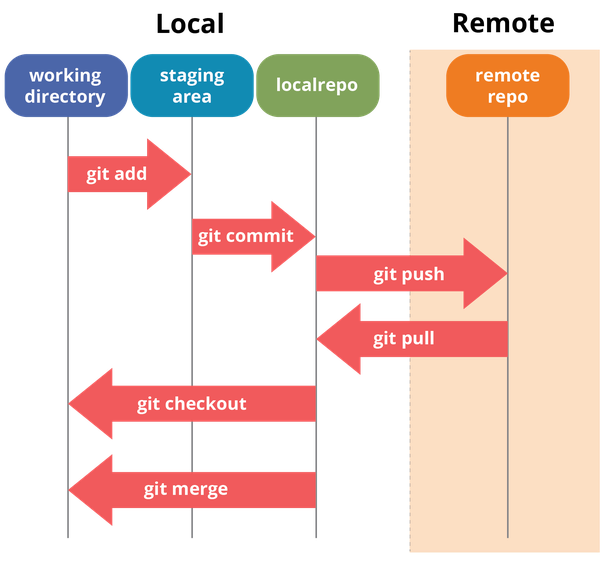

Git Practice

The staging area is a file, generally contained in your Git directory, that stores information about what will go into your next commit. Its technical name in Git parlance is the “index”, but the phrase “staging area” works just as well.

- After commit revert those changes 
    git reset HEAD^

- For remove local changes 
    git restore .

- For Staged to unstages changes 
    git reset      OR  ( git restore --staged . OR git restore -S . )
- Delete local Branch :
    git branch --delete branch_name       OR  git branch -d branch_name  

if use -D = force delete  

- Delete Remote Branch :
    git push origin --delete branch_name  OR  git push origin -d 
    
- Rename only local branch not remote branch
    git branch -m development-branch  
    // Rename on local and then push on remote than need to delete old branch from repo

- For Rename Remote branches 
  ** (IMP)** first checkout in that branch then delete that branch from remote  
	1. git push origin -d development
	2. rename local branch development => staging : git branch -m staging
	3. After Rename push on Remote  : git push origin -u staging

- for check head on which point and commit message
    git reflog

- This also discards all changes permanently.
    git reset --hard

- discards commit permanently.
    git reset --hard <commit-id> 
    Ex : git reset --hard 6dc63fb

- For remove local changes 
    git restore .

